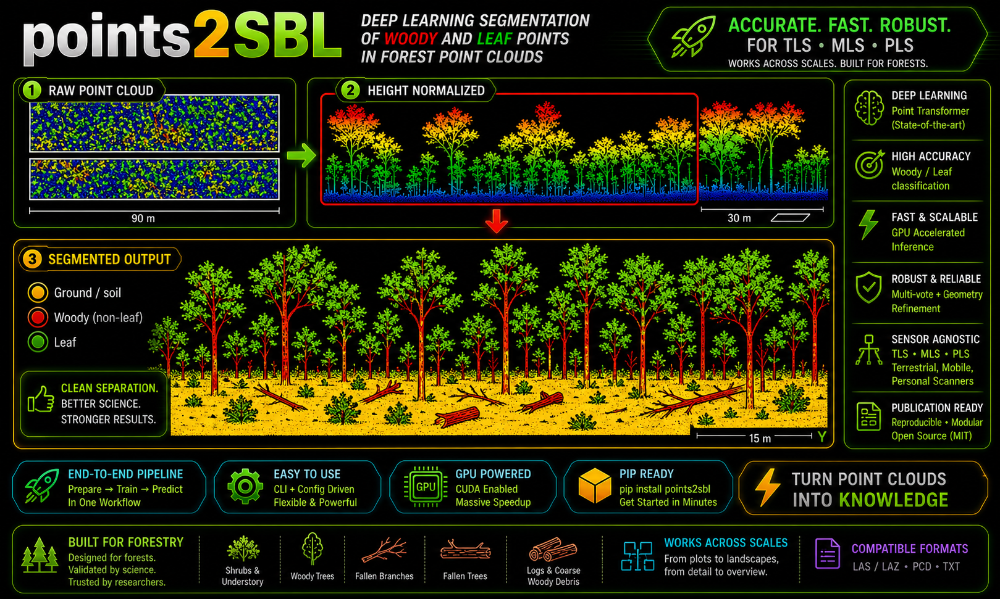
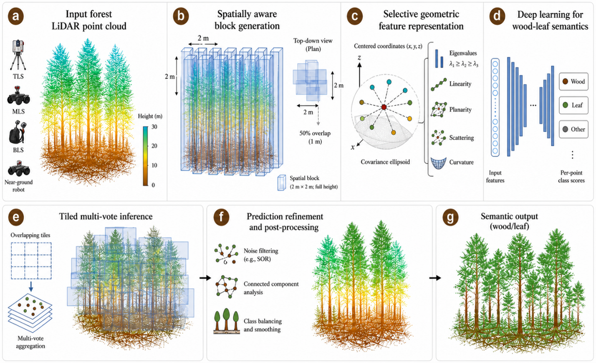
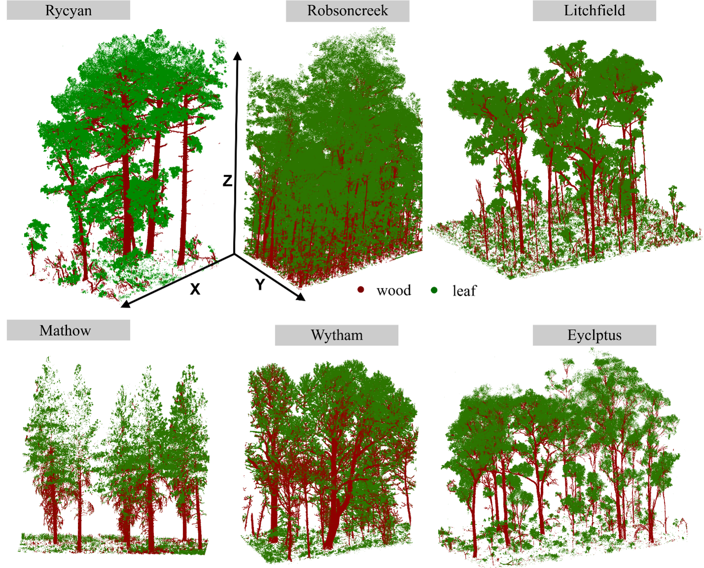
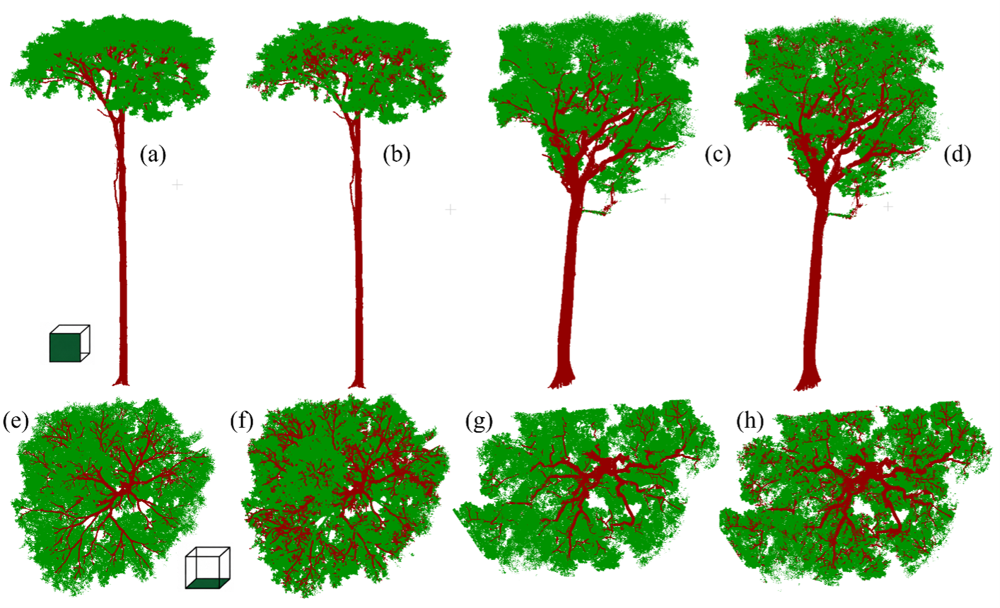
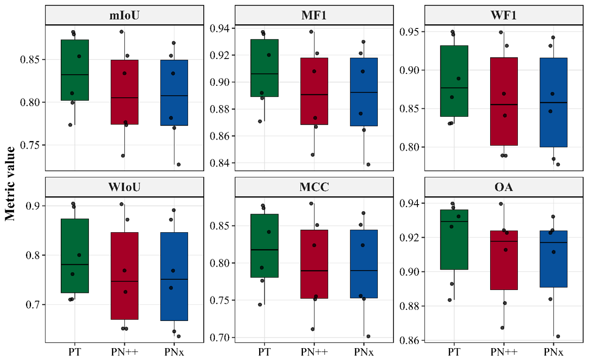
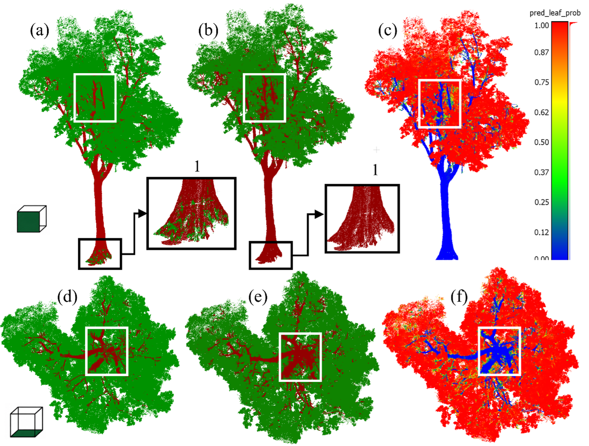
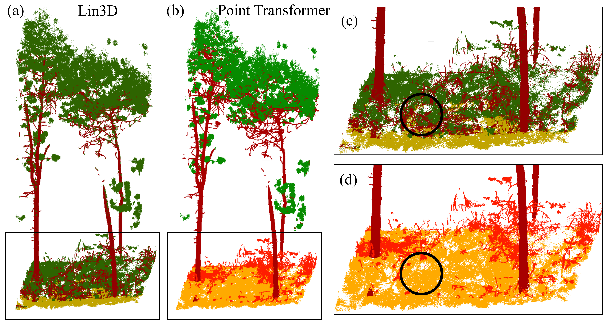
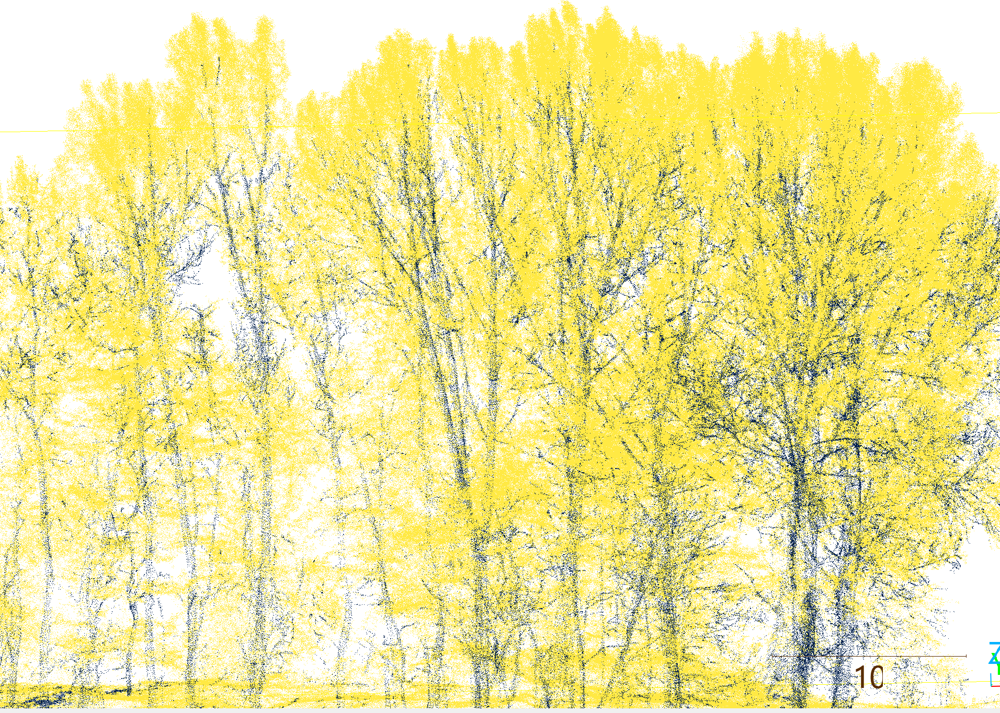

<div align="center">

# 🌲 points2SBL

> **Toward Operational Wildfire Fuel Mapping: Sensor-Agnostic Deep Learning Semantic Segmentation of Terrestrial LiDAR Across Global Forest Ecosystems**


</div>

<p align="center">

</p>

**points2SBL** is an open-source framework for binary semantic segmentation of forest LiDAR point clouds into **woody** and **foliar** components. The current release is designed to make pretrained-model inference straightforward for plot-scale and individual-tree point clouds while retaining the complete data-preparation and training workflow for advanced users.

The recommended production model is the **Point Transformer**. PointNeXt and PointNet++ remain available for comparison, ablation, and alternative deployment requirements.

---

## Highlights

| Capability | Support |
|---|:---:|
| Binary wood–leaf segmentation | ✅ |
| Point Transformer | ✅ Recommended |
| PointNeXt | ✅ |
| PointNet++ | ✅ |
| TLS plots | ✅ |
| Individual trees | ✅ |
| MLS / BLS / PLS | ✅ |
| ULS | ✅ |
| CPU and CUDA execution | ✅ |
| Single-file inference | ✅ |
| Recursive folder inference | ✅ |
| Automatic plot/tree detection | ✅ |
| Automatic single-tree tile selection | ✅ |
| `full`, `raw`, and `adaptive` inference modes | ✅ |
| Multi-vote probability aggregation | ✅ |
| Spatial confidence weighting | ✅ |
| Woody-structure refinement | ✅ |
| Prediction probability export | ✅ |
| JSON inference sidecars | ✅ |

---

# Installation

points2SBL supports both local installation from GitHub and direct installation from PyPI. The recommended workflow is to install the appropriate PyTorch build first and then install points2SBL.

---

## Option 1: Install from PyPI

Create and activate a clean environment:

```powershell
conda create -n points2sbl python=3.11 -y

conda activate points2sbl
```

Install the validated CUDA build of PyTorch:

```powershell
python -m pip install `
  torch==2.5.1 `
  torchvision==0.20.1 `
  torchaudio==2.5.1 `
  --index-url https://download.pytorch.org/whl/cu121
```

Install points2SBL:

```powershell
pip install points2sbl
```

Verify the installation:

```powershell
python -c "import points2sbl; print('points2SBL import successful')"

points2sbl --help
```

Download the pretrained model:

```powershell
points2sbl model download
```

Verify that the model is available:

```powershell
points2sbl model status
```

---

## Option 2: Install from GitHub (validated)

Clone the repository:

```powershell
git clone https://github.com/nadeemfareed/points2SBL.git

cd points2SBL
```

Create and activate a clean environment:

```powershell
conda create -n points2sbl python=3.11 -y

conda activate points2sbl
```

Install the validated CUDA build of PyTorch:

```powershell
python -m pip install `
  torch==2.5.1 `
  torchvision==0.20.1 `
  torchaudio==2.5.1 `
  --index-url https://download.pytorch.org/whl/cu121
```

Install points2SBL:

```powershell
python -m pip install -e .
```

Verify the installation:

```powershell
python -c "import points2sbl; print('points2SBL import successful')"

points2sbl --help
```

Download the pretrained model:

```powershell
points2sbl model download
```

Verify that the model is available:

```powershell
points2sbl model status
```

The pretrained model will be placed in:

```text
runs/
└── point_transformer_curated_20260327_170108/
    └── best.pt
```

---

### Google Colab support (validated)

Validated environment:

- Google Colab
- Python 3.12
- Linux
- Tesla T4 GPU
- PyTorch CUDA

Installation:
```
!pip install points2sbl
```powershell
Download model:
```
!points2sbl model download
```powershell
Inference:
```
!points2sbl predict \
    --input_type auto \
    --mode full \
    --config points2SBL/configs/point_transformer.yaml \
    --in_las input.las \
    --out_las output.las \
    --device cuda
```powershell
## Quick inference example

```powershell
points2sbl predict `
  --input_type auto `
  --mode full `
  --config ".\configs\point_transformer.yaml" `
  --in_las "input.las" `
  --out_las "output.las" `
  --device cuda
```

---

## Verify the installation

```powershell
python -c "import points2sbl; print('points2SBL import successful')"

points2sbl --help

points2sbl model status
```

---


The standard checkpoint location used throughout this README is:

```text
runs/
└── point_transformer_curated_20260327_170108/
    └── best.pt
```

The checkpoint contains the model configuration used during training. During inference, points2SBL uses the configuration embedded in the checkpoint when available to avoid feature and model mismatches.

---

# Validated environment

| Component | Version |
|---|---:|
| Operating system | Windows 11 |
| Python | 3.11 |
| PyTorch | 2.5.1 |
| CUDA | 12.1 |
| NumPy | 2.4.4 |
| SciPy | 1.17.1 |
| GPU | NVIDIA GeForce RTX 3070 Ti |

---

# Troubleshooting

### Verify installation

```powershell
points2sbl --help

points2sbl model status
```

### Download the pretrained model again

```powershell
points2sbl model download --force
```
# Quick start

For most users, these are the only concepts required:

- `--input_type` describes **what kind of point cloud is being processed**.
- `--mode` describes **how the model prediction is converted into the final wood–leaf result**.

The recommended general-purpose combination is:

```text
--input_type auto
--mode full
```

## Single file (Best performance - validated)

```powershell
points2sbl predict `
  --input_type plot `
  --mode full `
  --config $CFG `
  --ckpt $CKPT `
  --in_las "D:\input\forest_plot.las" `
  --out_las "D:\output\forest_plot_points2sbl_high_quality.las" `
  --device cuda `
  --votes 10 `
  --vote_mode hybrid8 `
  --vote_weight confidence `
  --geom_cache all `
  --progress tiles
```
## Single file (second best yet faster - validated)

```powershell
points2sbl predict `
  --input_type plot `
  --mode full `
  --config $CFG `
  --ckpt $CKPT `
  --in_las "D:\input\forest_plot.las" `
  --out_las "D:\output\forest_plot_points2sbl.las" `
  --device cuda `
  --geom_cache all `
  --progress tiles
```

## Folder (Batch processing - multiple input .laz/las files)

```powershell
points2sbl predict `
  --input_type plot `
  --mode full `
  --config $CFG `
  --ckpt $CKPT `
  --in_las "D:\input\forest_plot" `
  --out_las "D:\output\forest_plot_points2sbl" `
  --device cuda `
  --votes 10 `
  --vote_mode hybrid8 `
  --vote_weight confidence `
  --geom_cache all `
  --progress tiles
```
---

# Understanding `--input_type`

`--input_type` controls scene-level assumptions. It does **not** change the trained neural network.

Available values are:

```text
auto
plot
single_tree
```

## `--input_type plot`

Use `plot` for multi-tree forest scenes where class `2` represents ground.

```powershell
--input_type plot
```

Plot behavior:

- class `2` ground is preserved;
- ground is excluded from wood–leaf prediction; ( use fastgc https://github.com/nadeemfareed/FAST-GC to classify ground points before points2sbl deep learning" - fastgc is another package developed by author.
- the established plot denoising workflow is enabled by default;
- non-ground points are classified as wood or leaf.

Recommended for:

- TLS forest plots;
- MLS / BLS / PLS forest plots;
- ULS plots;
- multi-tree registered scenes with valid class-2 ground.

## `--input_type single_tree`

Use `single_tree` for isolated trees without ground.

```powershell
--input_type single_tree
```

Single-tree behavior:

- no ground assumption is imposed;
- ground exclusion is disabled;
- plot denoising is disabled;
- all tree points remain eligible for prediction;
- automatic tile selection is enabled unless the user explicitly supplies `--tile_size_m`.

This is important for isolated trees because sparse twigs, crown edges, and fine branches can otherwise be removed by a plot-oriented denoising step.

## `--input_type auto`

Use `auto` when the input type is not known in advance.

```powershell
--input_type auto
```

The current automatic resolver works independently for each input file. Class-2 ground is treated as strong evidence of a plot. For no-ground inputs, scene extent is used to distinguish compact individual trees from larger plot-scale clouds.

Conceptually:

```text
Input LAS/LAZ
    │
    ├── usable class-2 ground present
    │       └── plot
    │
    └── no usable class-2 ground
            ├── compact XY extent -> single_tree
            └── large XY extent   -> plot
```

For benchmark datasets whose `Classification=2` does not actually represent ground, use `--input_type single_tree` or an explicit no-ground configuration rather than `auto`.

---

# Automatic tile selection for individual trees

If `--input_type single_tree` is selected and `--tile_size_m` is not explicitly supplied, points2SBL chooses the tile size from the maximum XY extent of the tree.

| Maximum XY extent | Automatic tile size |
|---:|---:|
| `≤ 8 m` | `1.5 m` |
| `≤ 15 m` | `2.5 m` |
| `≤ 25 m` | `3.5 m` |
| `> 25 m` | `5.0 m` |

A manual value always takes precedence:

```powershell
--tile_size_m 4.0
```

The automatic system avoids applying one fixed spatial scale to trees with very different crown dimensions.

---

# Understanding `--mode`

`--mode` controls the inference decision/refinement strategy.

Available modes are:

```text
full
raw
adaptive
```

The same trained checkpoint can be used with all three modes.

## `--mode full`

`full` is the default production workflow.

```powershell
--mode full
```

It uses the established points2SBL inference pipeline, including:

- block-wise multi-vote inference;
- confidence-aware vote weighting;
- spatial vote weighting;
- dual-threshold wood/leaf decisions;
- local geometry support;
- smoothing;
- woody refinement;
- woody-structure refinement;
- small-component cleanup;
- uncertain-point reassignment.

Use `full` for routine processing and final production outputs.

## `--mode raw`

`raw` exposes the direct neural-network decision with minimal semantic post-processing.

```powershell
--mode raw
```

It disables optional semantic refinement such as:

- spatial refinement;
- smoothing;
- woody refinement;
- woody-structure refinement;
- small woody-component cleanup;
- uncertain-point reassignment.

Use `raw` for:

- model benchmarking;
- ablation studies;
- debugging;
- comparing direct network behavior against refined predictions.

## `--mode adaptive`

`adaptive` derives wood and leaf anchors from the empirical prediction-probability distribution for the current scene and resolves primarily the transition region using geometry/local support.

```powershell
--mode adaptive
```

It is useful when probability distributions shift between acquisitions, species, phenological conditions, or forest structures.

Adaptive mode preserves high-confidence wood and leaf regions while concentrating additional decision logic in the ambiguous transition zone.

Use it for:

- structurally complex forests;
- difficult benchmark datasets;
- scenes with a pronounced bimodal wood/leaf probability distribution;
- controlled comparison against `raw` and `full`.

---

# Recommended mode/type combinations

| Data | Recommended input type | Recommended mode |
|---|---|---|
| Standard TLS forest plot with class-2 ground | `plot` | `full` |
| MLS / BLS / PLS forest plot | `plot` or `auto` | `full` |
| ULS plot | `plot` or `auto` | `full` |
| Isolated TLS tree | `single_tree` | `full` |
| Folder of isolated trees | `single_tree` | `full` |
| Unknown mixed collection | `auto` | `full` |
| Direct network benchmark | appropriate scene type | `raw` |
| Scene-adaptive probability experiment | appropriate scene type or `auto` | `adaptive` |

---

# Single-file inference examples

The following examples assume execution from the repository root.

Set convenient variables in PowerShell:

```powershell
$CFG  = ".\configs\point_transformer.yaml"
$CKPT = ".\runs\point_transformer_curated_20260327_170108\best.pt"
```

## Example 1 — Standard plot, full production mode

```powershell
points2sbl predict `
  --input_type plot `
  --mode full `
  --config $CFG `
  --ckpt $CKPT `
  --in_las "D:\inference\TLS\plot01.las" `
  --out_las "D:\inference\TLS_pred\plot01_FULL.las" `
  --device cuda `
  --progress tiles
```

Use this when class `2` represents ground. Ground points are retained in the output and excluded from wood–leaf prediction.
## fastgc - https://github.com/nadeemfareed/FAST-GC
The best practice is to process the point clouds for ground classification using fastgc and then use the points2sbl with ground class available to reduce the processing time and accuracy (ground points do not belong to wood and foliage)

pip install fastgc

### Install from source
git clone https://github.com/nadeemfareed/FAST-GC.git
cd FAST-GC
pip install -e .

## Example 2 — Plot, raw model output

```powershell
points2sbl predict `
  --input_type plot `
  --mode raw `
  --config $CFG `
  --ckpt $CKPT `
  --in_las "D:\inference\TLS\plot01.las" `
  --out_las "D:\inference\TLS_pred\plot01_RAW.las" `
  --device cuda `
  --progress tiles
```

This is useful for evaluating the direct Point Transformer decision before the full semantic refinement pipeline.

## Example 3 — Plot, adaptive mode

```powershell
points2sbl predict `
  --input_type plot `
  --mode adaptive `
  --config $CFG `
  --ckpt $CKPT `
  --in_las "D:\inference\TLS\plot01.las" `
  --out_las "D:\inference\TLS_pred\plot01_ADAPTIVE.las" `
  --device cuda `
  --geom_cache all `
  --progress tiles
```

Adaptive mode derives scene-specific probability anchors and concentrates geometry/local support in the transition zone.

## Example 4 — Individual tree, automatic tile size

```powershell
points2sbl predict `
  --input_type single_tree `
  --mode full `
  --config $CFG `
  --ckpt $CKPT `
  --in_las "D:\single_trees\tree_001.las" `
  --out_las "D:\single_trees_pred\tree_001_FULL.las" `
  --device cuda `
  --progress tiles
```

No `--tile_size_m` is necessary. The individual-tree workflow automatically selects a tile size from the tree's XY extent.

## Example 5 — Individual tree with explicit tile-size override

```powershell
points2sbl predict `
  --input_type single_tree `
  --mode full `
  --config $CFG `
  --ckpt $CKPT `
  --in_las "D:\single_trees\tree_001.las" `
  --out_las "D:\single_trees_pred\tree_001_4m.las" `
  --device cuda `
  --tile_size_m 4.0 `
  --progress tiles
```

Explicit user settings override automatic tile selection.

## Example 6 — Automatic scene-type detection

```powershell
points2sbl predict `
  --input_type auto `
  --mode full `
  --config $CFG `
  --ckpt $CKPT `
  --in_las "D:\mixed_inputs\scene.las" `
  --out_las "D:\mixed_outputs\scene_FULL.las" `
  --device cuda `
  --progress tiles
```

Use this for general-purpose inference when the input may be either a plot or an individual tree.

## Example 7 — Four deterministic grid votes

```powershell
points2sbl predict `
  --input_type auto `
  --mode adaptive `
  --config $CFG `
  --ckpt $CKPT `
  --in_las "D:\inference\scene.las" `
  --out_las "D:\inference\scene_ADAPTIVE_4VOTES.las" `
  --device cuda `
  --votes 4 `
  --vote_mode grid4 `
  --vote_weight confidence `
  --geom_cache all `
  --progress tiles
```

Use this configuration when a fast deterministic four-layout comparison is desired.

## Example 8 — Eight-vote hybrid adaptive inference

```powershell
points2sbl predict `
  --input_type auto `
  --mode adaptive `
  --config $CFG `
  --ckpt $CKPT `
  --in_las "D:\inference\scene.las" `
  --out_las "D:\inference\scene_ADAPTIVE_HYBRID8.las" `
  --device cuda `
  --votes 8 `
  --vote_mode hybrid8 `
  --vote_weight confidence `
  --geom_cache all `
  --progress tiles
```

`hybrid8` combines structured and additional layouts to increase spatial coverage while confidence weighting reduces the influence of weak predictions.

## Example 9 — Advanced adaptive controls

Most users should not need these options. They are retained for controlled experiments and expert tuning.

```powershell
points2sbl predict `
  --input_type auto `
  --mode adaptive `
  --config $CFG `
  --ckpt $CKPT `
  --in_las "D:\inference\scene.las" `
  --out_las "D:\inference\scene_ADAPTIVE_ADVANCED.las" `
  --device cuda `
  --votes 8 `
  --vote_mode hybrid8 `
  --vote_weight confidence `
  --geom_cache all `
  --adaptive_hist_bins 256 `
  --adaptive_hist_smooth_sigma 2.0 `
  --adaptive_shoulder_fraction 0.02 `
  --adaptive_min_transition_width 0.10 `
  --adaptive_geom_ratio 0.85 `
  --adaptive_local_support_min 0.55 `
  --progress tiles
```

---

# Batch inference

Folder mode supports LAS and LAZ inputs. With `--recursive`, the input directory structure is reproduced under the output directory.

`--skip_existing` is useful for resumable processing.

## Example 10 — Folder of forest plots

```powershell
points2sbl predict `
  --input_type plot `
  --mode full `
  --config $CFG `
  --ckpt $CKPT `
  --in_dir "D:\inference\TLS_plots" `
  --out_dir "D:\inference\TLS_plots_points2sbl" `
  --recursive `
  --skip_existing `
  --device cuda `
  --progress tiles
```

## Example 11 — Folder of individual trees

```powershell
points2sbl predict `
  --input_type single_tree `
  --mode full `
  --config $CFG `
  --ckpt $CKPT `
  --in_dir "D:\single_trees" `
  --out_dir "D:\single_trees_points2sbl" `
  --recursive `
  --skip_existing `
  --device cuda `
  --progress tiles
```

Each tree independently receives the appropriate automatic tile size unless `--tile_size_m` is explicitly supplied.

## Example 12 — Mixed folder with automatic scene detection

```powershell
points2sbl predict `
  --input_type auto `
  --mode full `
  --config $CFG `
  --ckpt $CKPT `
  --in_dir "D:\mixed_forest_clouds" `
  --out_dir "D:\mixed_forest_clouds_points2sbl" `
  --recursive `
  --skip_existing `
  --device cuda `
  --progress tiles
```

Each file is resolved independently as a plot or single tree.

## Example 13 — First 10 files only

A limited batch is useful when validating a new dataset.

```powershell
points2sbl predict `
  --input_type single_tree `
  --mode full `
  --config $CFG `
  --ckpt $CKPT `
  --in_dir "D:\single_trees" `
  --out_dir "D:\single_trees_test10" `
  --recursive `
  --max_files 10 `
  --device cuda `
  --progress tiles
```

After validating the first files, remove `--max_files 10` to process the complete folder.

---

# Processing workflow

<p align="center">

</p>

The overall software workflow is:

```text
LAS/LAZ input
    │
    ▼
Input-type resolution
(plot / single_tree / auto)
    │
    ▼
Geometric feature construction
    │
    ▼
Point Transformer / PointNeXt / PointNet++ inference
    │
    ▼
Multi-layout probability aggregation
    │
    ▼
full / raw / adaptive decision workflow
    │
    ▼
LAS/LAZ prediction + probability + JSON sidecar
```

For retraining, the complete path is:

```text
Labeled LAS/LAZ
    │
    ▼
Data preparation and geometric feature extraction
    │
    ▼
Point Transformer / PointNeXt / PointNet++ training
    │
    ▼
Pretrained checkpoint
    │
    ▼
Inference workflow above
```

The default Point Transformer input uses seven channels:

```text
centered X, centered Y, centered Z,
linearity, planarity, scattering, curvature
```

---

# Input labels and prediction semantics

## Class convention

| Classification | Meaning |
|---:|---|
| `0` | Woody structure |
| `1` | Leaf or needle |
| `2` | Ground, when present |

Woody structure can include stems, branches, snags, and coarse woody material when those components are part of the annotation protocol.

## Plot input

For `--input_type plot`, class `2` is interpreted as ground and is preserved.

## Individual-tree input

For `--input_type single_tree`, no ground class is required.

## Benchmark/reference data

If the input contains manually curated reference labels that must be retained for quantitative evaluation, preserve them in a separate LAS extra-byte field or use a copied input before overwriting `Classification`.

---

# Output

The output LAS/LAZ preserves the original point geometry and supported LAS attributes while adding prediction information.

| Attribute | Meaning |
|---|---|
| `Classification` | Final class when classification overwrite is enabled |
| `pred_class` | Binary predicted class |
| `pred_leaf_prob` | Aggregated probability of the leaf class |
| JSON sidecar | Resolved settings and inference diagnostics |

Output class convention:

| Code | Meaning |
|---:|---|
| `0` | Wood |
| `1` | Leaf |
| `2` | Preserved ground when present and excluded from binary prediction |

The inference sidecar records the resolved configuration, tile size, vote strategy, geometry-cache settings, ground handling, denoising state, and refinement statistics.

---

# Advanced inference controls

The public interface intentionally keeps common workflows simple. Advanced parameters remain available for expert experiments.

## Voting

```text
--votes
--vote_mode {grid4,grid8,hybrid8,random}
--vote_weight {uniform,confidence}
```

## Geometry cache

```text
--geom_cache {none,all}
```

`all` computes geometric features once for the prediction points and reuses them during inference.

## Full-mode refinement

Advanced controls include:

```text
--t_low
--t_high
--geom_rescue_thr
--local_woody_thr
--local_leaf_thr
--smooth_k
--smooth_tau
--woody_refine_k
--woody_core_p_leaf_max
--woody_structure_k
```

## Adaptive mode

Advanced adaptive parameters include:

```text
--adaptive_hist_bins
--adaptive_hist_smooth_sigma
--adaptive_shoulder_fraction
--adaptive_min_transition_width
--adaptive_geom_ratio
--adaptive_local_support_min
```

Most users should use the mode defaults rather than changing these parameters.

---

# Performance notes

The current Point Transformer inference implementation reuses shared neighborhood information inside the model to reduce redundant computation during inference.

Runtime depends on:

- total number of points;
- tile size;
- number of overlapping layouts/votes;
- number of model blocks;
- geometric-feature computation;
- semantic refinement;
- GPU capability;
- disk speed.

On CUDA-capable systems, points2SBL automatically limits the default inference batch on lower-VRAM GPUs to reduce out-of-memory failures. Explicit `--batch_blocks` values override the automatic choice.

---

# Troubleshooting

## CUDA requested but unavailable

Check:

```powershell
python -c "import torch; print(torch.__version__); print(torch.version.cuda); print(torch.cuda.is_available())"
```

A CUDA-capable GPU and driver are not sufficient by themselves; PyTorch must also be installed with CUDA support.

## Editable installation replaced CUDA PyTorch

Install the desired CUDA PyTorch build first, then reinstall points2SBL without dependencies:

```powershell
python -m pip install -e . --no-deps
```

## OpenMP conflict on Windows

An error such as:

```text
OMP: Error #15: Initializing libomp.dll, but found libiomp5md.dll already initialized
```

means multiple OpenMP runtimes were loaded.

The preferred solution is to remove conflicting package builds and use a clean, consistent environment.

The following workaround may allow execution but is not recommended for production:

```powershell
$env:KMP_DUPLICATE_LIB_OK = "TRUE"
```

## Ground is predicted as wood or leaf

Use:

```powershell
--input_type plot
```

and confirm that true ground is stored as class `2`.

## Fine tree structure is removed

For isolated trees use:

```powershell
--input_type single_tree
```

This disables plot denoising and ground exclusion by default.

## Automatic input detection is inappropriate

Override it explicitly:

```powershell
--input_type plot
```

or:

```powershell
--input_type single_tree
```

## Need the unrefined network result

Use:

```powershell
--mode raw
```

## Need probability-distribution-driven thresholding

Use:

```powershell
--mode adaptive
```

## GPU out of memory

Reduce:

```powershell
--batch_blocks 8
```

or:

```powershell
--batch_blocks 4
```

Keep the checkpoint-compatible number of points per block unless intentionally testing another model configuration.

## Resume an interrupted folder run

Use:

```powershell
--skip_existing
```

Previously completed outputs are skipped and the remaining files are processed.

---

# Results gallery

The image paths below intentionally retain the existing repository filenames.

## Training datasets

<p align="center">

</p>

Representative labeled forest point clouds used for model development.

## Benchmark datasets

<p align="center">

</p>

Independent datasets used to assess segmentation accuracy and transferability.

## Model performance

<p align="center">

</p>

Comparative performance of Point Transformer, PointNet++, and PointNeXt.

## Tropical forest generalization

<p align="center">

</p>

Wood–leaf prediction on structurally complex tropical trees not used during training.

## Lin3D benchmark

<p align="center">

</p>

Reference labels and Point Transformer predictions for complex plot-level forest scenes.

## Large registered TLS plot

<p align="center">

</p>

Large-scale registered TLS prediction processed through block-wise multi-vote inference.

## ULS prediction

<p align="center">

</p>

Prediction on lower-density ULS data.

## BlueCat qualitative result

<p align="center">

</p>

Prediction on the structurally complex BlueCat TLS dataset.

## BlueCat reference, prediction, probability, and disagreement

<p align="center">

</p>

Reference labels, final prediction, leaf probability, and probability disagreement shown from complementary views.

> Keep the corresponding PNG files under `docs/images/`. If GitHub filenames differ, update the paths above to match the repository exactly.

---

# Advanced: data preparation

Most users using the released pretrained model can skip this section.

The transferable training workflow uses a common block representation across TLS, MLS, ULS, plot clouds, and individual trees.

## Mixed-sensor training corpus

Example layout:

```text
D:\points2SBL_training_raw\
├── TLS_plots\
├── TLS_single_trees\
├── MLS\
└── ULS\
```

Prepare the combined corpus:

```powershell
python -u -m points2sbl.prepare_data `
  --config "configs\point_transformer.yaml" `
  --data_root "D:\points2SBL_training_raw" `
  --recursive `
  --label_field Classification `
  --leaf_class 1 `
  --xy_size 2.0 2.0 `
  --stride 1.0 1.0 `
  --n_points 8192 `
  --min_points 64 `
  --val_ratio 0.20 `
  --rotate_train `
  --save_format npz
```

## TLS plot preparation

```powershell
python -u -m points2sbl.prepare_data `
  --config "configs\point_transformer.yaml" `
  --data_root "D:\training\TLS_plots" `
  --recursive `
  --label_field Classification `
  --leaf_class 1 `
  --xy_size 2.0 2.0 `
  --stride 1.0 1.0 `
  --n_points 8192 `
  --min_points 64 `
  --val_ratio 0.20 `
  --rotate_train `
  --save_format npz
```

## MLS / BLS / PLS preparation

```powershell
python -u -m points2sbl.prepare_data `
  --config "configs\point_transformer.yaml" `
  --data_root "D:\training\MLS" `
  --recursive `
  --label_field Classification `
  --leaf_class 1 `
  --xy_size 2.0 2.0 `
  --stride 1.0 1.0 `
  --n_points 8192 `
  --min_points 64 `
  --val_ratio 0.20 `
  --rotate_train `
  --save_format npz
```

## ULS preparation

A larger block can be used when building a dedicated lower-density ULS model:

```powershell
python -u -m points2sbl.prepare_data `
  --config "configs\point_transformer.yaml" `
  --data_root "D:\training\ULS" `
  --recursive `
  --label_field Classification `
  --leaf_class 1 `
  --xy_size 3.0 3.0 `
  --stride 1.5 1.5 `
  --n_points 8192 `
  --min_points 64 `
  --val_ratio 0.20 `
  --rotate_train `
  --save_format npz
```

## Individual-tree preparation

For a dedicated individual-tree training corpus:

```powershell
python -u -m points2sbl.prepare_data `
  --config "configs\point_transformer.yaml" `
  --data_root "D:\training\single_trees" `
  --recursive `
  --label_field Classification `
  --leaf_class 1 `
  --xy_size 5.0 5.0 `
  --stride 2.5 2.5 `
  --n_points 8192 `
  --min_points 64 `
  --val_ratio 0.20 `
  --rotate_train `
  --save_format npz
```

Prepared datasets typically contain:

```text
<data_root>/
├── train/
├── val/
├── test/                 # when requested
└── _prepare_report.json
```

Before training, inspect `_prepare_report.json` and confirm that files, classes, and train/validation blocks were created as expected.

---

# Advanced: training

Most users using the released checkpoint can skip this section.

Point Transformer is the recommended production architecture. PointNeXt and PointNet++ are retained for comparison and experimentation.

## Point Transformer

```powershell
python -u -m points2sbl.train `
  --config "configs\point_transformer.yaml" `
  --data_root "D:\points2SBL_training_raw" `
  --out_dir "runs\point_transformer_mixed_sensors" `
  --device cuda
```

## PointNeXt

```powershell
python -u -m points2sbl.train `
  --config "configs\pointnext.yaml" `
  --data_root "D:\points2SBL_training_raw" `
  --out_dir "runs\pointnext_mixed_sensors" `
  --device cuda
```

## PointNet++

```powershell
python -u -m points2sbl.train `
  --config "configs\pointnet2.yaml" `
  --data_root "D:\points2SBL_training_raw" `
  --out_dir "runs\pointnet2_mixed_sensors" `
  --device cuda
```

A training run typically produces:

```text
runs/<run_name>/
├── best.pt
├── last.pt
├── config_resolved.json
├── metrics.jsonl
└── train.log
```

Use `best.pt` for production inference unless a specific experiment requires another checkpoint.

---
```

Generated caches, build directories, local checkpoints, temporary patches, and prediction outputs should not be committed to Git.

---

# Citation

If you use points2SBL, please cite the accompanying manuscript:

```bibtex
@article{Nadeem2026points2SBL,
  title   = {Toward Operational Wildfire Fuel Mapping: Sensor-Agnostic Deep Learning Semantic Segmentation of Terrestrial LiDAR Across Global Forest Ecosystems},
  author  = {Nadeem, Fareed et al.},
  journal = {Remote Sensing},
  year    = {2026},
  note    = {Under review}
}
```

---

# License

points2SBL is released under the GNU General Public License v3.0 (GPL-3.0). See `LICENSE` for details..

---

# Contact

**Fareed Nadeem**  
School of Forest, Fisheries, and Geomatics Sciences  
University of Florida  
nadeem@geomatics.ncku.edu.tw
fareed.nadeem@ufl.edu

GitHub: [nadeemfareed](https://github.com/nadeemfareed)

<div align="center">

**points2SBL — pretrained inference first, reproducible training when needed**

</div>
